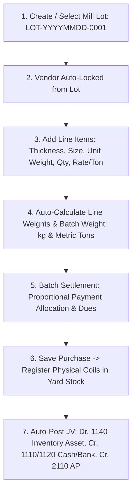
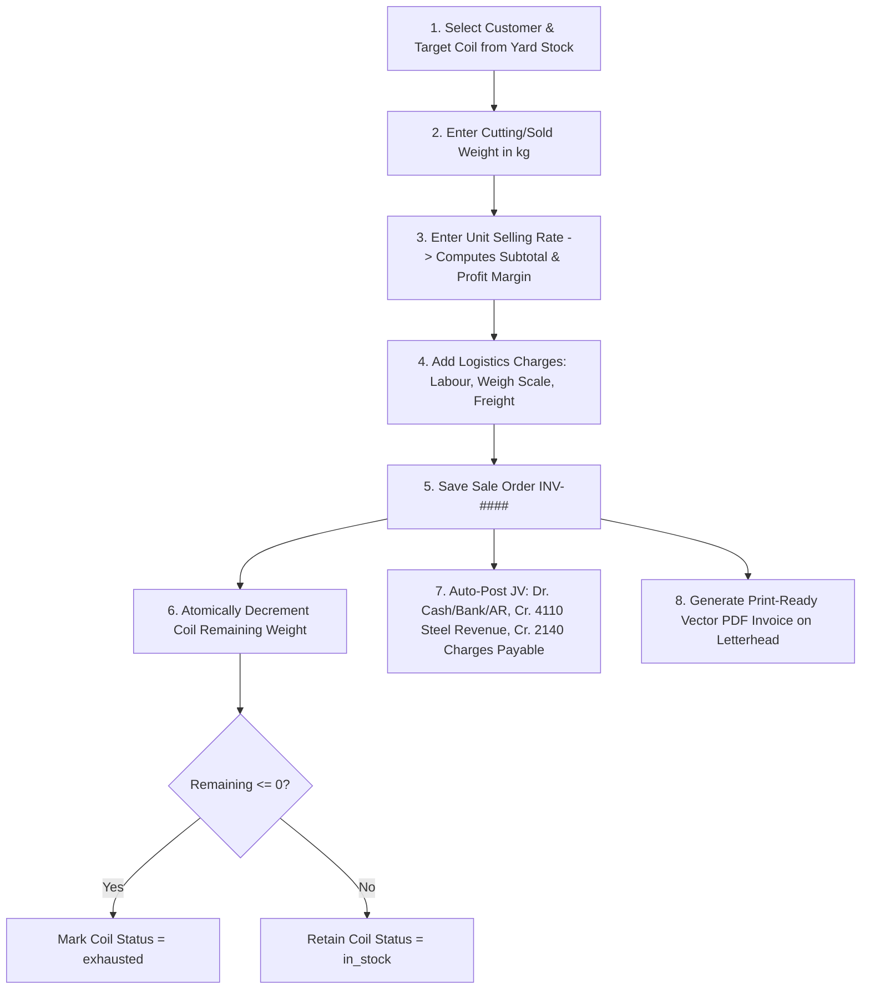

# 🏗️ Steel Inventory (Ship Steel Coils & Plates ERP) — Deep Project Analysis

> **App Name:** Steel Inventory (`steel_inventory`)  
> **Framework:** Laravel 11.55.1  
> **PHP Requirement:** ^8.2 (PHP 8.2+ / PHP 8.3)  
> **Database:** MySQL (`steel_inventory`)  
> **Environment:** Local (Laragon / `127.0.0.1:8000`)  
> **Last Updated:** September 2026  

---

## 1. 🗂️ Project Overview

**Steel Inventory** is an industrial-grade enterprise ERP, double-entry accounting system, and **ship steel coil/plate yard management system** built on **Laravel 11**. Designed specifically for steel manufacturing mills, ship-breaking steel re-rollers, plate stockists, and heavy industrial distribution yards:

- **Ship Steel Coils & Heavy Plates Registry**: Physical continuous stock tracked at the individual piece/coil level (`COIL-YYYYMMDD-####`), recording dimensional specifications (thickness, width, length/size, piece count, intake net weight in kg, remaining weight in kg, rate per ton, and real-time status: `in_stock`, `in_processing`, `exhausted`, `scrapped`).
- **Mill Lot Procurement Management**: Batch procurement linked to Mill/Consignment Lots (`LOT-YYYYMMDD-####`), recording multi-row physical intake with vendor locking, quick AJAX lot registration, row weight calculations (kg and metric tons), proportional batch payment allocation, and automatic yard coil registration.
- **Dedicated Creation & Editing Interfaces**: Full-width dedicated interfaces for Purchase Creation (`/purchases/create`) and Purchase Editing (`/purchases/{id}/edit`) with **Sold Weight Protection Checks** ensuring intake weight cannot be reduced below already sold/dispatched quantities.
- **Commercial Sales & Weight Deduction**: Sales order fulfillment (`INV-####`) with fractional coil weight deduction, line-item profit tracking against acquisition rates, pass-through logistics charges (labour, weigh scale, freight), third-party handler payout workflow, and real-time WebSocket broadcasting (`SaleCreatedEvent`).
- **Product Returns & Restocking**: Structured return authorization (`returns`, `return_items`) with return condition assessment, refund settlement, and yard restocking.
- **Full Double-Entry Accounting & Bookkeeping**: 5-Class Chart of Accounts (Asset 1000, Liability 2000, Equity 3000, Revenue 4000, Expense 5000), self-balancing journal vouchers (`JV-YYYYMMDD-####`), General Ledger, Trial Balance, Profit & Loss (P&L), Balance Sheet, Cash Flow Statement, Fiscal Year closing, and Customer/Vendor Party Ledgers.
- **mPDF Vector Report Standard**: High-fidelity vector PDF generation matching the application design system with base64 letterhead watermarks, dark slate header typography, zebra striping, and authorized signature blocks.
- **Role-Based Access Control (RBAC)**: Spatie Permission (`spatie/laravel-permission ^6.4`) with granular permissions across 11 functional modules and two core roles (`Super Admin` and `Employee`).

---

## 2. 🏗️ Architecture

```
steel_inventory/
├── app/
│   ├── Console/Commands/
│   │   └── InitAccountBalances.php   # Artisan command (accounts:init-balances)
│   ├── Events/
│   │   └── SaleCreatedEvent.php      # Real-time WebSocket event for sales
│   ├── Helpers/
│   │   ├── FormatHelper.php          # Formatting utilities
│   │   ├── LibraryHelper.php         # Library & asset helper routines
│   │   ├── NumberToWords.php         # Number to words converter (for invoices and vouchers)
│   │   └── helpers.php               # Global accounting helpers (postJournalEntry, getAccountBalance, getInvoicePadBase64)
│   ├── Http/
│   │   ├── Controllers/              # 30 domain controllers (Sales, Purchase, Coil, Lot, Accounts, etc.)
│   │   ├── Middleware/               # Spatie RBAC, auth guards
│   │   └── Requests/                 # Form requests (StorePurchaseRequest, UpdatePurchaseRequest, etc.)
│   ├── Mail/                         # Mailable classes (e.g. CreateSalesMail)
│   ├── Models/                       # 29 Eloquent models (Coil, Purchase, Lot, Sale, ChartOfAccount, JournalEntry, etc.)
│   └── Services/                     # Dedicated business services (PurchaseService, SaleService, InventoryService)
├── database/
│   ├── migrations/                   # 8 domain-consolidated database migrations
│   ├── factories/
│   └── seeders/                      # UserSeeder, PermissionSeeder, ChartOfAccountSeeder, DatabaseSeeder
├── resources/
│   ├── views/
│   │   ├── frontend/                 # ERP views (Blade templates)
│   │   │   ├── layouts/              # app, head, header, sidebar, right_sidebar
│   │   │   └── pages/                # 22 module sections (coils, purchase, lots, sales, accounts, etc.)
│   │   ├── pdf/                      # mPDF invoice, ledger, and statement templates
│   │   │   └── accounts/             # Voucher, Ledger, Trial Balance, P&L, Balance Sheet templates
│   │   ├── auth/                     # Authentication views
│   │   └── errors/
│   ├── css/, js/, sass/
├── routes/
│   ├── web.php                       # Main application routes (209 active routes)
│   ├── api.php                       # API endpoints (Sanctum protected)
│   └── console.php
├── public/                           # Assets, letterhead pads (assets/invoice/pad.png), uploads
├── config/                           # App, auth, permission, database configurations
└── storage/
```

### Architectural Patterns & Principles
- **MVC Architecture** — Clean separation between Eloquent Models, Blade Views, and Controllers.
- **Service Layer Pattern** — Complex transactions isolated into dedicated services (`PurchaseService`, `SaleService`) with database transaction safety and automated accounting voucher creation.
- **Weight-Based Inventory Integrity** — The physical stock is maintained in `coils` as decimal weights (kg/tons). Sales transactions decrement remaining weight and update status flags atomically.
- **Double-Entry Accounting Engine** — Self-balancing journal voucher posting with debit/credit equilibrium guarantees (`postJournalEntry()`), Storno error reversals (`reverseJournalEntry()`), and strict fiscal period guards.
- **Dual PDF Engine** — High-performance vector PDF rendering with `mpdf/mpdf ^8.3` using authenticated signature blocks, exact millimeter margins, and base64 letterhead pads.

---

## 3. 🔑 Authentication & Authorization

### Authentication
- Built on `laravel/ui` (Bootstrap 5 authentication scaffolding).
- **Public registration disabled** → `Auth::routes(['register' => false, 'reset' => false, 'verify' => false])`.
- Secondary PIN-based administrative authorization (`/user/pin`).
- `laravel/sanctum` installed for API token authorization.

### Authorization — Spatie Role-Based Access Control (RBAC)
Managed by **Spatie Laravel Permission** (`spatie/laravel-permission ^6.4`):

| Role | Access Scope |
|------|--------------|
| **Super Admin** | Full access to all 11 modules: Administration, Sales, Customers, Payments, Purchases, Inventory/Coils, Vendors, Accounts & Finance, HR & Payroll, Company Profile, Reports |
| **Employee** | Dedicated Employee Dashboard (`/dashboard`) + personal TA/DA self-service portal (`/employee/tada`) |

---

## 4. 📊 Core Modules & Capabilities

### 4.1 🏷️ Steel Procurement & Mill Lot Management
Designed for industrial steel procurement where goods are sourced in mill batches (Lots) with dimensional specifications:

| Model | Table | Key Fields & Capabilities |
|-------|-------|--------------------------|
| `Lot` | `lots` | `lot_number` (`LOT-YYYYMMDD-0001`), `vendor_id`, `lot_date`, `status` (`active`/`closed`), `total_quantity` (weight sum), `total_amount`, `notes`, `created_by` |
| `Purchase` | `purchases` | `lot_id`, `vendor_id`, `warehouse_id`, `thickness`, `size`, `size_type`, `unit_weight`, `total_weight`, `quantity`, `unit_price`, `sub_price`, `total_price`, `payment`, `due`, `payment_method`, `bank_detail_id` |

#### Key Steel Procurement Features:
- **Dedicated Purchase Order Creation (`/purchase/create`)**:
  - Full-width line item table supporting dynamic multi-row creation.
  - **Lot-Vendor Coupling**: Selecting a Lot auto-populates and locks the Vendor.
  - **Embedded Quick Add Lot**: Modal on create purchase page for instant AJAX Lot registration without losing form state.
  - **Batch & Row Weight Engine**: Calculates line item weight (`quantity * unit_weight`) and batch totals in Kilograms (kg) and Metric Tons.
  - **Proportional Payment Allocation**: Distributes batch payments across line items and calculates exact item dues.
  - **Automated Coil Registration**: Automatically inserts a matching physical coil record into `coils` for immediate yard stock tracking.
  - **Auto-Posting Journal Voucher**: Intakes inventory (Dr. 1140 Inventory Asset) against Cash/Bank disbursements (Cr. 1110/1120) and Accounts Payable (Cr. 2110).
- **Dedicated Purchase Order Editing (`/purchase/{id}/edit`)**:
  - Edit physical specifications, quantities, weights, and pricing.
  - **Sold Weight Protection Check**: Detects if any portion of the linked coil has already been sold and prevents lowering intake weight below the sold quantity.
  - Synchronizes linked `coils` record and recalculates affected Lot totals.

---

### 4.2 ⚙️ Ship Steel Coils & Plates Registry
The single source of truth for physical inventory in the yard:

| Model | Table | Key Fields & Capabilities |
|-------|-------|--------------------------|
| `Coil` | `coils` | `coil_number` (`COIL-YYYYMMDD-0001`), `purchase_id`, `lot_id`, `vendor_id`, `warehouse_id`, `thickness`, `width`, `length`, `piece_count`, `gross_weight`, `tare_weight`, `net_weight`, `remaining_weight`, `rate_per_ton`, `total_price`, `status` (`in_stock`, `in_processing`, `exhausted`, `scrapped`) |
| `Warehouse` | `warehouses` | Storage yards, locations, and warehouse capacity tracking |

#### Key Coil Features:
- **Sequential Coil Tagging**: Unique auto-generated coil identifiers (`COIL-YYYYMMDD-####`).
- **Computed Attributes**:
  - `remaining_coils`: Converts remaining weight into remaining physical pieces (e.g. 5 coils @ 500kg, sold 150kg = 3.5 coils).
  - `remaining_percentage`: Real-time percentage of remaining weight relative to intake net weight.
  - `unit_weight`: Weight per piece/plate.
- **Stock Overview & PDF Export**: Filterable by Lot, Vendor, Warehouse Yard, and Status, with instant mPDF stock inventory report generation (`/inventory/pdf`).

---

### 4.3 💰 Sales, Commercial Logistics & Extra Charges
| Model | Table | Key Fields & Capabilities |
|-------|-------|--------------------------|
| `Sale` | `sales` | `order_no` (`INV-####`), `order_date`, `customer_id`, `subtotal`, `discount`, `vat`, `tax`, `total`, `payble`, `advanced_payment`, `due_payment`, `payment_method`, `bank_detail_id`, `delivery_status`, `delivery_charge`, `labour_cost`, `weight_scale_cost`, `other_charges`, `charges_payout_status`, `status` |
| `SalesItem` | `sales_items` | `order_id`, `coil_id`, `lot_id`, `thickness`, `size`, `size_type`, `qty` (weight), `unit_price`, `total_price`, `purchase_price`, `profit`, `returned_qty` |
| `Customer` | `customers` | Client records with opening balances and ledger history |
| `Payment` | `payments` | Customer receipts and vendor disbursements |

#### Key Sales Features:
- **Fractional Weight Deductions**: Selling deducts sold weight from `coils.remaining_weight`. When remaining weight reaches 0, status transitions to `exhausted`.
- **Pass-Through Extra Charges**: Captures crane/labour fees (`labour_cost`), certified bridge scale fees (`weight_scale_cost`), and transport freight (`delivery_charge`).
- **Handler Payout Tracking**: Tracks whether collected pass-through charges have been disbursed to third-party drivers or labour gangs (`charges_payout_status`: `unpaid`/`paid`).
- **Customer Party Ledger (`/customers/{id}/ledger`)**: Running balance statement showing prior balance, invoices, payments, and balance carried forward, exportable via mPDF.
- **High-Precision Invoice Generation (`/sales/invoice/{id}/pdf`)**: Print-ready sales invoices on official letterhead with complete specification breakdowns.

---

### 4.4 📒 Double-Entry Accounting & Financial Statements
A complete GAAP/IFRS-compliant double-entry accounting engine fully integrated with operational transactions:

| Model | Table | Purpose |
|-------|-------|---------|
| `ChartOfAccount` | `chart_of_accounts` | 5-Class tree: Asset (1000), Liability (2000), Equity (3000), Revenue (4000), Expense (5000). Linked to `bank_details`. |
| `FiscalYear` | `fiscal_years` | Accounting periods with start/end dates, active status flag, and year-end closing locks. |
| `JournalEntry` | `journal_entries` | Immutable voucher headers with auto-sequencing `JV-YYYYMMDD-0001`, audit metadata, and Storno reversal keys. |
| `JournalEntryItem` | `journal_entry_items` | Split debit and credit transaction lines with individual account allocations. |

#### Core Accounting Engine:
- **Master Chart of Accounts**: Pre-seeded standard accounts with normal balance rules (`isDebitNormal()`) and recursive balance calculations.
- **Journal Vouchers (JV)**: Multi-row split debit/credit creator with real-time balance validation.
- **General Ledger**: Chronological transaction audit trail with running balances, opening balance brought forward, date filters, and PDF/CSV export.
- **Trial Balance**: Instant debit vs. credit balance validation verifying equation equilibrium across all active accounts.
- **Financial Statements**:
  - Profit & Loss (P&L) with Gross Margin and Net Operating Income.
  - Balance Sheet with Asset, Liability, and Equity balancing.
  - Cash Flow Statement categorized by Operating, Investing, and Financing activities.
- **Auto-Posting Triggers**: Operational hooks in `SaleService`, `PurchaseService`, `ExpenseController`, and `SalaryController` automatically generate balanced vouchers.

---

### 4.5 🔄 Returns, HR & Personnel
- **Product Returns (`returns`, `return_items`)**: Structured return workflow with condition recording, inventory restocking, and refund tracking.
- **HR & Payroll (`employees`, `salaries`, `ta_das`)**: Monthly salary generation, advance salary deductions, and employee self-service TA/DA request portal.
- **Operational Expense Tracking (`daily_expenses`, `expense_categories`)**: Categorized petty cash and yard expense tracking.

---

## 5. 🗄️ Database Schema Summary

> **Total Migrations:** 8 Domain-Consolidated Migrations  
> **Database Engine:** MySQL (`steel_inventory`)  

```
database/migrations/
├── 2024_01_01_000001_create_users_and_auth_tables.php
│   └── users, password_resets, failed_jobs, personal_access_tokens
├── 2024_01_01_000002_create_permission_tables.php
│   └── roles, permissions, model_has_roles, model_has_permissions, role_has_permissions
├── 2024_01_01_000003_create_activity_logs_and_extras_tables.php
│   └── activity_logs, extras
├── 2024_01_01_000004_create_master_entities_tables.php
│   └── company_details, bank_details, warehouses, vendors, customers, lots
├── 2024_01_01_000005_create_hr_and_expenses_tables.php
│   └── employees, salaries, expense_categories, daily_expenses, ta_das
├── 2024_01_01_000006_create_procurement_and_coils_tables.php
│   └── purchases, coils, inventories
├── 2024_01_01_000007_create_sales_and_returns_tables.php
│   └── sales, sales_items, payments, returns, return_items
└── 2024_01_01_000008_create_accounting_system_tables.php
    └── fiscal_years, chart_of_accounts, journal_entries, journal_entry_items
```

---

## 6. 📦 Key Dependencies & Technology Stack

### Backend
| Package | Version | Purpose |
|---------|---------|---------|
| `laravel/framework` | ^11.55 | Core web framework |
| `php` | ^8.2 | Language requirement |
| `laravel/ui` | ^4.5 | Bootstrap auth scaffolding |
| `laravel/sanctum` | ^4.0 | API token authentication |
| `spatie/laravel-permission` | ^6.4 | Granular Role-Based Access Control |
| `spatie/laravel-activitylog` | ^4.12 | Transaction and user audit logging |
| `spatie/laravel-backup` | ^9.3 | Database and file backups |
| `mpdf/mpdf` | ^8.3 | High-precision vector PDF generation with custom letterhead pads |
| `maatwebsite/excel` | ^3.1 | CSV and spreadsheet exports |
| `pusher/pusher-php-server` | ^7.2 | Real-time WebSocket notifications |
| `twilio/sdk` | ^8.3 | SMS notifications |

### Frontend & UI Guidelines
- **Blade Templating Engine** with Bootstrap 5 layout components.
- **Select2 & Custom Badges** for styled form controls.
- **No Breadcrumbs Policy**: Strict project guideline (`.agents/AGENTS.md`) eliminating `<ul class="breadcrumb">` navigation tags for modern, clean headers.
- **3-Dot Table Action Dropdowns**: Configured with `data-bs-popper-config='{"strategy":"fixed"}'` to ensure dropdown menus float freely above table containers without viewport clipping.

---

## 7. 🛣️ Route Structure & Navigation

The application registers **209 active routes** organized into 8 main workflow sections:

| Section | Key Routes | Primary Controller | Functionality |
|---------|------------|--------------------|---------------|
| **Dashboard** | `/dashboard` | `FrontendController` | Executive metrics, financial KPI cards, stock summary, recent activities |
| **Procurement** | `/purchase`, `/purchase/create`, `/purchase/{id}/edit`, `/lots`, `/vendors` | `PurchaseController`, `LotController`, `VendorController` | Batch purchase orders, lot consignment tracking, vendor profiles, vendor dues & party ledgers |
| **Inventory & Yard** | `/inventory`, `/coils`, `/warehouses` | `InventoryController`, `CoilController`, `WarehouseController` | Stock overview, ship steel coils & plates registry, warehouse/yard management |
| **Sales & Commercial** | `/sales`, `/sales/create`, `/sales/invoice/{id}/pdf`, `/due-payments`, `/returns` | `SalesController`, `PaymentController`, `ReturnController` | Sales orders, vector PDF invoices, customer receivables, sales returns |
| **Accounts & Finance** | `/accounts/chart-of-accounts`, `/accounts/journal-entries`, `/accounts/ledger`, `/accounts/trial-balance`, `/accounts/reports/*` | `ChartOfAccountController`, `JournalEntryController`, `LedgerController`, `TrialBalanceController`, `FinancialStatementController` | Double-entry bookkeeping, general ledger, trial balance, P&L, balance sheet, cash flow |
| **HR & Payroll** | `/employees`, `/salary`, `/daily-expenses`, `/employee/tada` | `EmployeeController`, `SalaryController`, `ExpenseController`, `EmployeeTaDaController` | Staff records, monthly payroll, petty cash expenses, employee self-service TA/DA |
| **Reports** | `/sales-report`, `/purchase-report`, `/extra-charges-report`, `/revenues` | `SalesController`, `PurchaseController`, `RevenueController` | Sales analytics, purchase analytics, freight & charges report, revenue margins |
| **Administration** | `/users`, `/role`, `/permission`, `/company-details`, `/bank-details` | `UserController`, `RoleController`, `PermissionController`, `CompanyDetailController`, `BankDetailController` | User access, RBAC security, corporate profile, bank accounts |

---

## 8. 🔄 Core Steel Business Workflows

### Steel Lot Procurement & Yard Intake Flow


### Steel Sales & Fractional Cutting Flow


---

## 9. 📋 Setup & Deployment Guide

```bash
# 1. Clone repository and install dependencies
composer install
npm install

# 2. Configure environment file
cp .env.example .env
php artisan key:generate

# 3. Configure Database (.env)
DB_CONNECTION=mysql
DB_HOST=127.0.0.1
DB_PORT=3306
DB_DATABASE=steel_inventory
DB_USERNAME=root
DB_PASSWORD=

# 4. Run database migrations
php artisan migrate

# 5. Seed initial data (Users, Roles, Permissions, Master Chart of Accounts)
php artisan db:seed

# 6. Build frontend assets
npm run build

# 7. Start local development server (or access via Laragon)
php artisan serve
```

> **Default Local Server:** `http://127.0.0.1:8000`

---

*Document updated: September 2026*  
*Maintained by: Antigravity AI Engineering Assistant*
