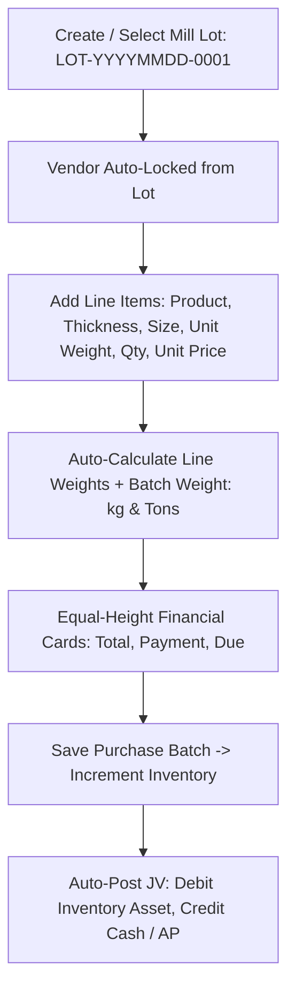
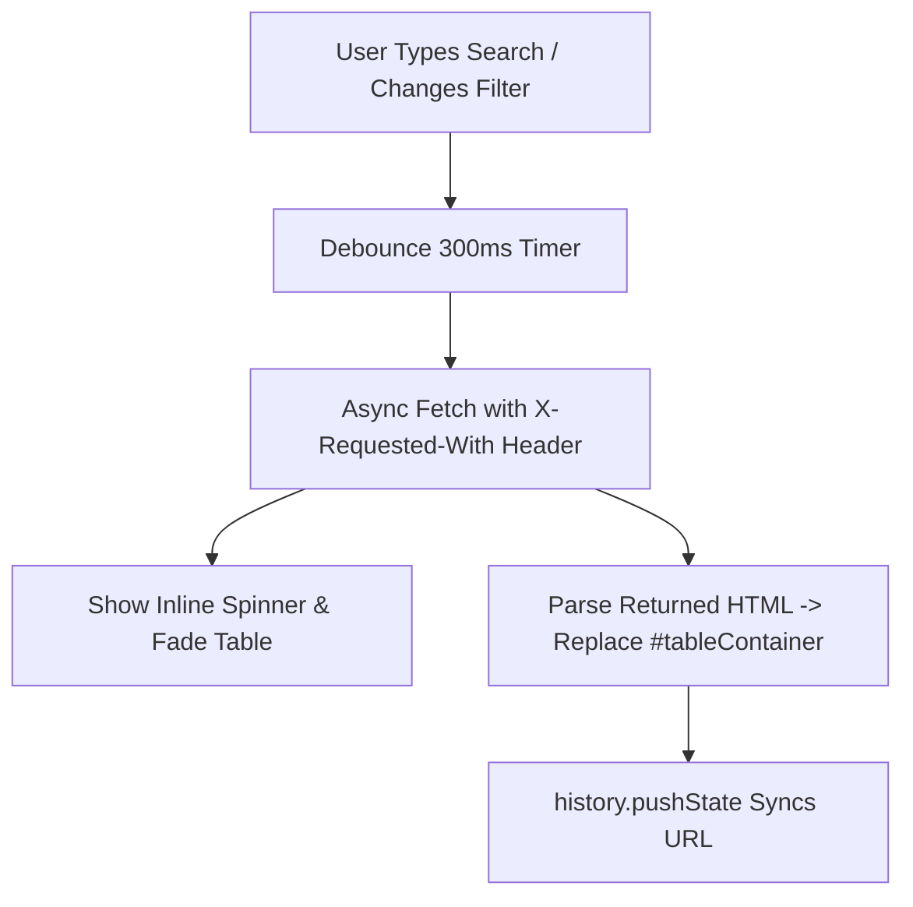

# 🏗️ Steel Inventory (Steel & Rebar ERP) — Deep Project Analysis

> **App Name:** Steel Inventory (`steel_inventory`)
> **Framework:** Laravel 10.x
> **PHP Requirement:** ^8.1 / PHP 8.2+ / PHP 8.3
> **Database:** MySQL (`steel_inventory`)
> **Environment:** Local (Laragon / `127.0.0.1:8000`)
> **Last Migration Date:** August 2026 (Steel Lot Management & Physical Specifications)

---

## 1. 🗂️ Project Overview

**Steel Inventory** is a specialized ERP, double-entry accounting, and **steel/rebar procurement & trading system** built on **Laravel 10**. Designed specifically for steel manufacturing mills, stockists, and industrial distribution centers:

- **Steel & Mill Procurement Management**: Batch procurement linked to Mill/Purchase Lots, recording batch-level physical specifications (thickness, size/length, unit weight, total batch weight in kg/tons), vendor locking, and quick lot creation.
- **Double-Entry Accounting & Bookkeeping**: 5-Class Chart of Accounts, auto-balancing journal vouchers, General Ledger, Trial Balance, P&L, Balance Sheet, Cash Flow, Contra Transfers, Bank Reconciliation, and Fiscal Year Closing.
- **Product Catalog & Steel Specifications**: High-performance catalog with 25-item pagination, multi-field live debounced AJAX search (name, model, barcode, thickness, size), serialized heat tracking, and default physical dimensions.
- **Dedicated Creation Workflows**: Full-page dedicated interfaces for Purchase Creation (`/purchases/create`) and Product Creation (`/products/create`) eliminating modal viewport constraints.
- **Sales & Distribution**: Multi-channel sales, automated receivables management, stock deduction, and real-time WebSocket broadcasting.
- **Product Returns & Warranty**: Restocking workflow, negative refund settlements, serial warranty verification, and reverse journal postings.
- **mPDF Vector Report Standard**: Standardized high-fidelity PDF invoice and audit reports featuring base64 letterhead watermarks, dark slate header typography, zebra striping, and signature blocks.
- **Role-Based Access Control (RBAC)**: Spatie Permission with granular permissions across 38 ERP modules.

---

## 2. 🏗️ Architecture

```
steel_inventory/
├── app/
│   ├── Console/Commands/  # Artisan commands (e.g., accounts:init-balances)
│   ├── Events/            # Real-time WebSocket events (e.g., SaleCreatedEvent)
│   ├── Exceptions/        # Custom exception handlers
│   ├── Helpers/
│   │   ├── helpers.php        # Global accounting & utility helpers (postJournalEntry, getAccountBalance, etc.)
│   │   └── NumberToWords.php  # Number to words converter (for invoices and vouchers)
│   ├── Http/
│   │   ├── Controllers/   # 55 controllers (PurchaseController, LotController, ProductController, Sales, Accounts, etc.)
│   │   ├── Middleware/    # ValidateFiscalYear, Spatie RBAC, auth guards
│   │   └── Kernel.php
│   ├── Mail/              # Mailable classes (e.g., CreateSalesMail)
│   ├── Models/            # 55 Eloquent models (Lot, Purchase, Product, ChartOfAccount, JournalEntry, Sale, etc.)
│   ├── Providers/
│   └── Services/          # Dedicated business services (PurchaseService, SaleService, InventoryService, WarrantyService)
├── database/
│   ├── migrations/        # 79 database migrations (including Lots & Physical Specs)
│   ├── factories/
│   └── seeders/           # ChartOfAccountSeeder, Role & Permission seeders
├── resources/
│   ├── views/
│   │   ├── frontend/      # Admin ERP views (Blade templates)
│   │   │   ├── layouts/   # master, sidebar, header, footer
│   │   │   └── pages/     # 39 module sections including /purchase/, /lots/, /product/, /accounts/
│   │   ├── pdf/           # mPDF & DomPDF invoice, voucher, and ledger templates
│   │   │   └── accounts/  # Voucher, Ledger, Trial Balance, P&L, Balance Sheet templates
│   │   ├── auth/
│   │   └── errors/
│   ├── css/, js/, sass/
├── routes/
│   ├── web.php            # Main role-protected routes (315+ routes)
│   ├── __web.php          # Legacy route archive
│   ├── api.php            # API endpoints
│   └── console.php
├── public/                # Assets, final_pad.png letterhead backgrounds, uploads
├── config/                # App, auth, permission, pdf configurations
└── storage/
```

### Architecture Patterns & Principles
- **MVC Architecture** — Strict separation between Eloquent Models, Blade Views, and Controllers.
- **Service Layer Pattern** — Complex transactions isolated into dedicated services (`PurchaseService`, `SaleService`, `InventoryService`, `WarrantyService`) with database transaction safety and balance allocation.
- **Live Debounced AJAX Filtering** — Real-time 300ms debounced search and instantaneous filter swaps without full page reloads across Products (`/products`) and Lots (`/lots`).
- **Double-Entry Accounting Engine** — Self-balancing journal voucher posting with debit/credit equilibrium guarantees, Storno error corrections, and strict fiscal period guards.
- **Dual PDF Engine** — High-performance vector PDF rendering with `carlos-meneses/laravel-mpdf` using authenticated signature blocks and base64 letterhead pads.

---

## 3. 🔑 Authentication & Authorization

### Authentication
- Built on `laravel/ui` (Bootstrap authentication scaffolding).
- **Public registration disabled** → `Auth::routes(['register' => false, 'reset' => false, 'verify' => false])`.
- Secondary PIN-based administrative authorization (`/user/pin`).
- `laravel/sanctum` installed for secure internal/external API token authorization.

### Authorization — Spatie Role-Based Access Control (RBAC)
Managed by **Spatie Laravel Permission** (`spatie/laravel-permission ^6.3`):

| Role | Access Scope |
|------|--------------|
| **Super Admin / Admin** | Full access to all modules, including Double-Entry Accounting, Steel Procurement, Lot Management, HR Payroll, and Financial Reports |
| **Employee** | Dashboard view + personal TA/DA self-service submission portal |

---

## 4. 📊 Modules & Features

### 4.1 🏷️ Steel Procurement & Lot Management (New)
Designed for steel manufacturing and trading where procurement occurs in mill batches (Lots) with varying physical specifications.

| Model | Table | Key Fields & Capabilities |
|-------|-------|--------------------------|
| `Lot` | `lots` | `lot_number` (`LOT-YYYYMMDD-0001`), `vendor_id`, `lot_date`, `status` (`active`/`closed`), `notes`, `created_by` |
| `Purchase` | `purchases` | `lot_id`, `product_id`, `vendor_id`, `thickness`, `size`, `size_type`, `unit_weight`, `total_weight`, `quantity`, `unit_price`, `sub_price`, `total_price`, `payment`, `due` |

#### Key Steel Procurement Features:
- **Dedicated Purchase Order Page (`/purchases/create`)**:
  - Full-width line item table supporting dynamic multi-row creation.
  - **Lot-Vendor Coupling**: Selecting a Lot auto-populates and locks the Vendor field (`readonly` display input + hidden `vendor_id`).
  - **Embedded Quick Add Lot**: Modal on create purchase page for instant AJAX Lot registration without losing form state.
  - **Batch & Row Weight Engine**: Calculates line item weight (`quantity * unit_weight`) and batch totals in Kilograms (kg) and Metric Tons.
  - **Equal-Height Financial Cards**: Symmetrical metric tiles for Total Batch Weight, Grand Total (৳), Payment Amount, and Outstanding Due.
- **Lot Management Dashboard (`/lots`)**:
  - Real-time debounced AJAX search and filtering by Vendor, Status, and Date Range.
  - Summary metrics per lot: Total Purchases Count, Total Quantity/Weight, Total Amount, and Status.
  - Dedicated Lot Detail page (`/lots/{id}`) showing comprehensive procurement breakdowns and associated orders.

---

### 4.2 🛒 Product Catalog & Steel Specifications
| Model | Table | Key Fields & Capabilities |
|-------|-------|--------------------------|
| `Product` | `products` | `name`, `category_id`, `brand_id`, `model`, `thickness`, `size`, `size_type`, `weight`, `barcode`, `photos` (JSON), `warranty`, `is_serialized`, `status` |
| `Inventory` | `inventories` | `product_id`, `opening_stock`, `current_stock` |
| `ProductSerial` | `product_serials` | Unique alphanumeric serial / heat tracking per piece for warranty verification |

#### Key Product Features:
- **Dedicated Product Create Page (`/products/create`)**:
  - Multi-section layout: General Information, Steel Specifications & Dimensions, and Serial Tracking & Media.
  - One-click auto-generating barcode utility (`ITP-XXXXXX`).
  - Clean, placeholder-free input structure.
- **Product Catalog (`/products`)**:
  - Configured with 25 items per page using Bootstrap 5 pagination.
  - Live AJAX search querying across Product Name, Model/Grade, Barcode, Thickness, and Size across all database records.

---

### 4.3 📒 Double-Entry Accounting & Bookkeeping
A complete, GAAP/IFRS-compliant double-entry accounting engine fully integrated with operational transactions.

| Model | Table | Purpose |
|-------|-------|---------|
| `ChartOfAccount` | `chart_of_accounts` | Recursive parent-child account tree across 5 standard classes: Asset (1000), Liability (2000), Equity (3000), Revenue (4000), Expense (5000). Linked to `BankDetail`. |
| `FiscalYear` | `fiscal_years` | Financial accounting periods with start/end dates, active status flag, and year-end closing locks. |
| `JournalEntry` | `journal_entries` | Immutable voucher headers with auto-sequencing `JV-YYYYMMDD-0001`, audit metadata, and Storno reversal foreign keys. |
| `JournalEntryItem` | `journal_entry_items` | Split debit and credit transaction lines with individual account allocations. |
| `ContraEntry` | `contra_entries` | Internal liquid fund transfers (Cash-to-Bank, Bank-to-Bank) with auto `CN-YYYYMMDD-0001` sequencing. |
| `AccountReconciliation` | `account_reconciliations` | Bank statement balance verification and variance tracking against General Ledger book balances. |

#### Core Accounting Features:
- **Master Chart of Accounts**: 39 pre-seeded standard accounts with normal balance rules (`isDebitNormal()`) and recursive child balance calculations.
- **Journal Vouchers (JV)**: Interactive multi-row split debit/credit creator with real-time dynamic JavaScript equilibrium validation.
- **General Ledger**: Chronological transaction audit trail with running balances, opening balance brought forward, date filters, and PDF export.
- **Trial Balance**: Automatic debit vs. credit balance validation verifying equation equilibrium across all active accounts.
- **Financial Statements**: Profit & Loss (P&L), Balance Sheet, and Cash Flow Statement.
- **Auto-Posting Triggers**: Operational hooks in `SaleService`, `PurchaseService`, `ExpenseController`, `SalaryController`, `ServiceController`, and `ReturnController` automatically generate double-entry vouchers upon transaction execution.

---

### 4.4 💰 Sales & Customer Management
| Model | Table | Key Fields & Capabilities |
|-------|-------|--------------------------|
| `Sale` | `sales` | `order_no` (`INV-...`), `customer_id`, `total`, `payble`, `advanced_payment`, `due_payment`, `discount`, `vat`, `tax`, `delivery_charge`, `status` |
| `SalesItem` | `sales_items` | `product_id`, `unit_price`, `purchase_price`, `profit`, `qty`, `returned_qty` |
| `Customer` | `customers` | Retail and wholesale customer CRM |
| `Payment` | `payments` | Transaction records linked to sales with audit tracking |

---

### 4.5 🔄 Returns, Service, Projects, & HR Modules
- **Product Returns (`returns`)**: Approval workflow with automatic inventory restocking, accounts receivable/payable adjustments, and reversal JVs.
- **Service & Workshop (`services`)**: Repair ticketing, lifecycle tracking, technician ratings, and dedicated service billing.
- **Project Management (`projects`)**: Direct project costing, milestone budgeting, and project bill generators.
- **Commercial Documents**: Quotations, Challans, and Bills with PDF export.
- **HR & Payroll (`employees`, `salaries`, `ta_das`)**: Monthly payroll disbursements and employee self-service TA/DA portal.

---

## 5. 🗄️ Database Schema Summary

> **Total Migrations:** 79
> **Database:** MySQL (`steel_inventory`)

### Comprehensive Table Inventory

| Category | Tables |
|----------|--------|
| **Core & RBAC** | `users`, `roles`, `permissions`, `model_has_roles`, `model_has_permissions`, `role_has_permissions`, `activity_logs`, `notifications` |
| **Steel Procurement & Lots** | `lots`, `purchases`, `vendors` |
| **Double-Entry Accounting** | `chart_of_accounts`, `fiscal_years`, `journal_entries`, `journal_entry_items`, `contra_entries`, `account_reconciliations` |
| **Catalog & Stock** | `products`, `product_serials`, `categories`, `brands`, `inventories` |
| **Sales & CRM** | `sales`, `sales_items`, `customers`, `clients`, `payments`, `revenues` |
| **Returns & Warranty** | `returns`, `return_items`, `warranty_claims`, `warranty_claim_logs` |
| **Service Workshop** | `services`, `rating_reviews` |
| **Projects & Costs** | `projects`, `project_items`, `project_costs`, `cost_categories` |
| **Billing Documents** | `bills`, `bill_items`, `challans`, `challan_items`, `quotations`, `quotation_items` |
| **HR & Payroll** | `employees`, `salaries`, `advance_salaries`, `attendances`, `ta_das` |
| **Company & Banking** | `company_details`, `bank_details`, `daily_expenses`, `expense_categories` |

---

## 6. 📦 Key Dependencies & Technology Stack

### Backend
| Package | Version | Purpose |
|---------|---------|---------|
| `laravel/framework` | ^10.10 | Core framework |
| `laravel/ui` | ^4.4 | Bootstrap auth scaffolding |
| `laravel/sanctum` | ^3.3 | API token authentication |
| `spatie/laravel-permission` | ^6.3 | Role-Based Access Control |
| `carlos-meneses/laravel-mpdf` | ^2.1 | High-precision vector PDF generation with custom letterhead pads |
| `barryvdh/laravel-dompdf` | ^3.1 | Secondary PDF export utilities |
| `cviebrock/eloquent-sluggable` | ^10.0 | SEO slug generation |
| `guzzlehttp/guzzle` | ^7.8 | HTTP client |
| `pusher/pusher-php-server` | ^7.2 | Real-time WebSocket notifications |
| `twilio/sdk` | ^8.3 | SMS notifications |

### Frontend & UI Guidelines
- **Blade Templating Engine** with responsive layouts.
- **Select2 & Bootstrap 5** form components with custom styling.
- **No Breadcrumbs Policy**: Strict project guideline (`.agents/AGENTS.md`) eliminating `<ul class="breadcrumb">` navigation tags for cleaner, modern headers.
- **Live Debounced AJAX Search**: Vanilla JS + fetch API updating `#productTableContainer` and `#lotTableContainer` dynamically.

---

## 7. 🛣️ Key Route Groups

| Route Group | Primary Controller | Functionality |
|-------------|--------------------|---------------|
| `purchase/*` | `PurchaseController` | Dedicated purchase create page (`/purchases/create`), line item persistence, batch settlement |
| `lots/*` | `LotController` | Lot dashboard, live AJAX search/filter, quick store modal, lot show breakdown |
| `products/*` | `ProductController` | Product catalog with 25-item AJAX search, dedicated create page (`/products/create`) |
| `accounts/*` | `ChartOfAccountController`, `JournalEntryController`, etc. | Full Double-Entry Accounting module (32 routes) |
| `sales/*` | `SalesController` | Sales orders, invoice generation, due payment processing, reports |
| `inventory/*` | `InventoryController`, `ProductSerialController` | Stock monitoring, serial lookups, PDF inventory list |

---

## 8. 🔄 Core Steel Business Workflows

### Steel Lot Procurement Flow


### Real-Time Live Filter Flow


---

## 9. 📋 Setup & Deployment Guide

```bash
# 1. Clone repository and install dependencies
composer install
npm install

# 2. Configure environment file
cp .env.example .env
php artisan key:generate

# 3. Configure Database (.env)
DB_CONNECTION=mysql
DB_HOST=127.0.0.1
DB_PORT=3306
DB_DATABASE=steel_inventory
DB_USERNAME=root
DB_PASSWORD=

# 4. Run database migrations
php artisan migrate

# 5. Seed initial data (Roles, Permissions, Master Chart of Accounts)
php artisan db:seed
php artisan db:seed --class=ChartOfAccountSeeder

# 6. Initialize operational opening balances (AR, Inventory, AP, Equity)
php artisan accounts:init-balances

# 7. Build assets and run
npm run build
php artisan serve
```

> **Default Local Server:** `http://127.0.0.1:8000`

---

*Document updated: August 2026*
*Maintained by: Antigravity AI Engineering Assistant*
